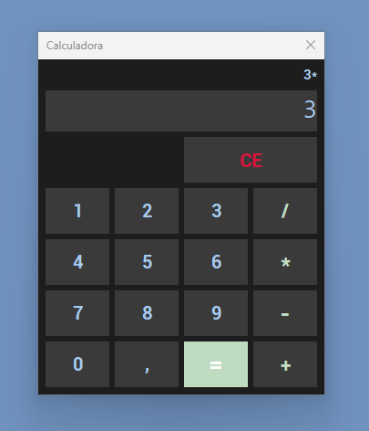

# Calculadora em Delphi

## Descrição
Este projeto é uma **calculadora simples desenvolvida em Delphi**, utilizando a VCL (Visual Component Library).  
Permite realizar operações básicas: **soma, subtração, multiplicação e divisão**, com interface gráfica intuitiva.  

O projeto serve como exemplo de manipulação de componentes visuais (TPanel, TSpeedButton, TLabel, TEdit) e lógica de cálculos em Delphi.

---

## Funcionalidades
- Inserção de números através de botões numéricos.
- Inserção de ponto decimal.
- Operações matemáticas básicas:  
  - Soma (+)  
  - Subtração (-)  
  - Multiplicação (*)  
  - Divisão (/) com tratamento de divisão por zero.
- Botão para calcular o resultado.
- Botão para limpar a tela e reiniciar os cálculos.
- Exibição do cálculo em andamento em um **Label**.

---

## Estrutura do Código

### Componentes Principais
- `TLabel lblResultado` – Exibe o cálculo em andamento.
- `TEdit edtResultado` – Campo de entrada de números.
- `TSpeedButton` – Botões para números, operadores e funções.
- `TPanel` – Agrupa os botões para organização visual.

### Variáveis Privadas
- `FNumero: double` – Armazena o número atual para cálculo.
- `FExpressao: char` – Armazena o operador selecionado.

### Procedimentos e Funções
- `PreencherNumeroCalculo(pNumero: string)` – Adiciona números ao campo de entrada.
- `PreencherExpressaoCalculo(pExpressao: string)` – Define o operador e prepara o cálculo.
- `PreencherLabelCalculo` – Atualiza a label com o número e operador atual.
- `LimparTudo` – Limpa o campo de entrada, label e variáveis de controle.
- `ObterResultado: double` – Retorna o valor do campo de entrada como double.
- `Calcular` – Executa o cálculo baseado no operador selecionado.
- `Somar, Subtrair, Multiplicar, Dividir: double` – Funções que realizam as operações matemáticas.
- Eventos dos botões chamam esses procedimentos conforme a interação do usuário.

---

## Como Executar
1. Abra o projeto no **Delphi** (compatível com Delphi 10 ou superior).  
2. Compile o projeto.  
3. Execute o formulário principal (`TelaPrincipal`).  
4. Clique nos botões numéricos e operadores para realizar cálculos.  

---

## Observações
- O botão de divisão possui tratamento para evitar divisão por zero.  
- A interface é totalmente construída com **VCL**, sem bibliotecas externas.

---

## Screenshot

